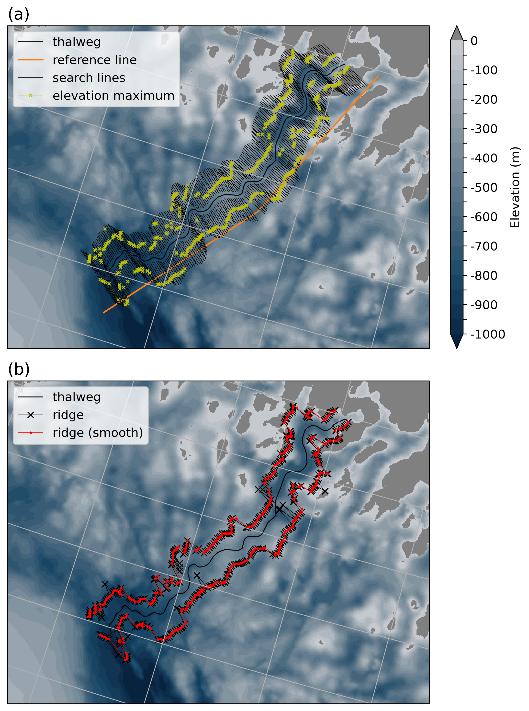

# Ridgeline Program

## Overview:
This notebook provides a framework for extracting maximum elevation values ('ridges') along either side of a predefined thalweg or channel (obtained from QGIS).

## Summary: 
To identify ridges, the program searches along lines extending from the thalweg. A reference line that runs roughly parallel to the thalweg is used to define the angle at which search lines extend from the thalweg. Outlier points along the ridge based on spatial coordinates are then smoothed to provide a final ridgeline product.

## Application: 
Ridgelines defined by this program are plotted over CTD transects of temperature and salinity to see how bathymetric patterns may shape local hydrography. The development of this program and examples included herein used bathymetric data from the continental shelf in Melville Bay, northwest Greenland.

## User guide:
For instructions and code to run the program, refer to the Jupyter notebook located in this repo found [here](https://github.com/mjzahn/Ridgeline_program/blob/main/ridgeline_program_user_guide.ipynb).

## Image showing process to extract ridgelines:
The figure below shows an example for a transect beginning at a glacier front (here, Rink Glacier in NW Greenland) and ending offshore at the edge of the continental shelf. In the ridgeline program, elevation maximums are identified along search lines extending from the thalweg (a) and then outlier points are corrected to provide a final, smoothed line (b). 

